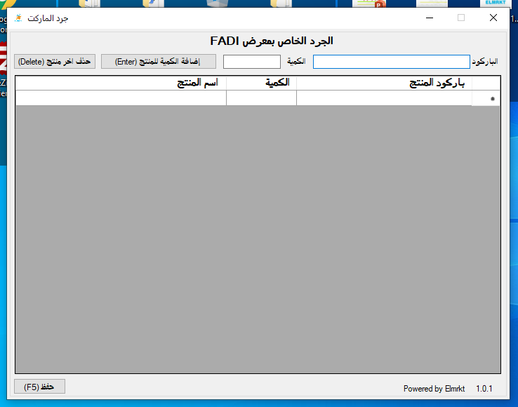

# Elmrkt-Inventory-Tool
This is a Tool to help Elmrkt Customers to create Inventory Excel Sheet ready to upload without the need to use Microsoft Excel
The Tool provides the client with the product name while doing his inventory check
The Tool automatically checks for updates and update it self during startup

# ScreenShots
1- Start screen and checking for updates

2-Retreiving the client Store ID for the first time

3-Main Screen

Hope you like my work!
